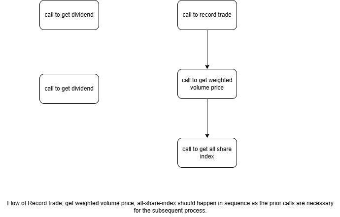

# StockAnalyser
## Overview

StockAnalyser is a comprehensive tool designed to assist investors with basic calculations of metrics and indicators

## Features

- Analysis of historical stock data
- Calculation of primary metrics on the stock data
- Real-time tracking of stock prices

## Installation

To install StockAnalyser, clone the repository and install the necessary dependencies:
```bash
git clone https://github.com/yourusername/StockAnalyser.git
cd StockAnalyser
pip install -r requirements.txt
```

## Usage

To get started with the StockAnalyser API, execute the following command:
```bash
uvicorn api:app --reload
```
- Visit the API documentation at [docs](http://localhost:8000/docs) to explore the request payload and response structure.
- A Postman collection is provided for convenient import and quick usage.

### Problem Statement

The StockAnalyser tool aims to provide investors with essential metrics and indicators for informed decision-making. The tool should integrate seamlessly with existing features and provide the following functionalities:

- Integrate SimpleSuperStock as an adapter layer to retrieve specific stock information:
    - Retrieve dividend information
    - Retrieve PE ratio
- Utilize TradingDatastore as an in-memory database for recording and querying stock data
- Employ TradingMetrics for calculating metrics based on available stock data and trading records

### API flow


